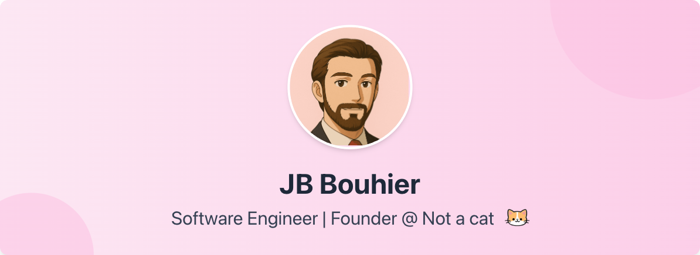

# Not a cat

> Clever apps, not just whiskers

Welcome to my one-person SaaS adventure. I'm building thoughtful, impactful applications that solve real problems. No fluff.

## About

I'm a solo entrepreneur passionate about creating meaningful software. Currently bootstrapping my way through the SaaS landscape, focusing on building products that deliver genuine value.

## Current Focus

- Building and launching MVPs quickly
- Validating ideas through real user feedback
- Creating sustainable, bootstrapped businesses

## Paws and browse

    
    
    
    

Building digital products, one commit at a time. 

*I am [not a cat](https://notacatventures.com)*